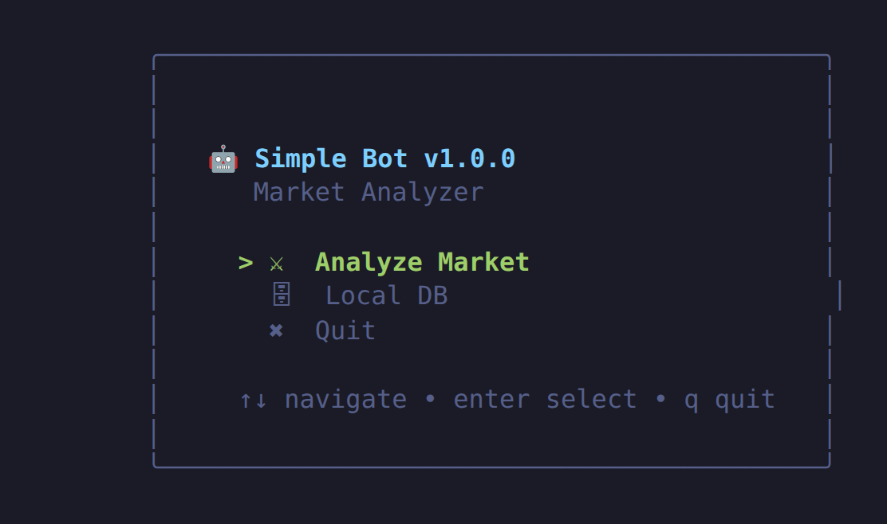
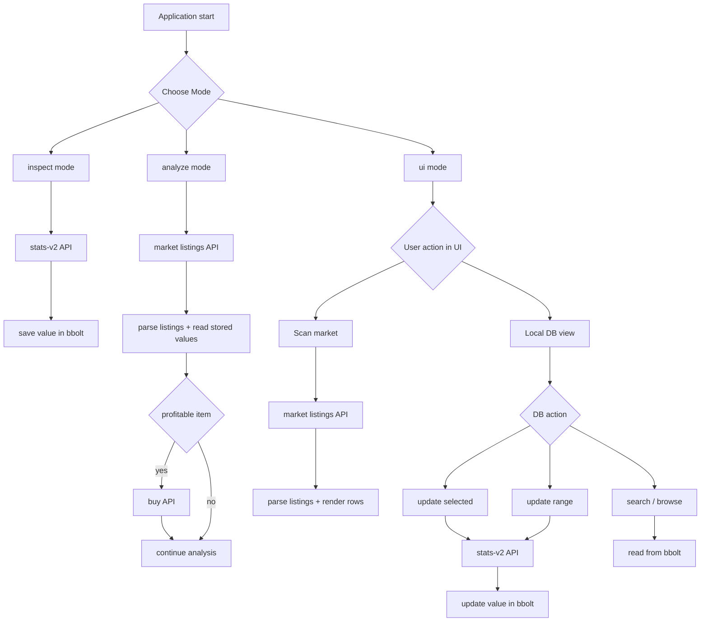

# Simple Bot 🤖

Simple Bot is a Go application for analyzing and automating item management in a live market in a massive multiplayer online game (MMO). It scans market listings, compares item value against cost, auto-buys profitable deals, and persists inspected item values in a local bbolt database — all driven from a single binary with a Bubble Tea terminal UI.



## Requirements 📦
- Go 1.26+
- [bbolt](https://github.com/etcd-io/bbolt) for local storage

## Getting Started 🚀
1. Clone the repository
2. Copy `.env.template` to `.env` and set `APP_BASE_URL` (optionally `DB_PATH`, defaults to `internal/database/data.db`)
3. Create a `call.txt` file with the raw `curl` command (headers + cookie) used to authenticate against the market API — copy it from your browser's dev tools ("Copy as cURL")
4. Build and run the application:
   ```sh
   go run ./cmd/simple-bot ui
   ```

   Or use the provided Makefile targets:
   ```sh
   make go-build                    # builds dev/simple-bot
   make analyze-market               # runs analyze mode, logs to output.log
   make inspect-items INIT=1 END=100 # runs inspect mode for an ID range
   ```

## Run Modes
- `inspect <start_id> <end_id>`: bulk inspect IDs and persist values
- `analyze`: market analysis in terminal logs
- `ui`: interactive TUI (scan + local DB management)
- `version` (or `--version`, `-v`): prints current application version

## Internal Modules (Detailed)
- `cmd/simple-bot/main.go`
   - Entry point
   - Loads config, creates HTTP client, opens bbolt store, routes mode
- `configs/config.go`
   - Loads environment variables (mainly `APP_BASE_URL`)
- `internal/utils`
   - HTTP calls, parsing, inspect flow, market scan, buy operations
- `internal/ui`
   - Bubble Tea app state, scan view, DB view, range updates
- `internal/database/keystore.go`
   - bbolt storage abstraction for item values (`kv` bucket)
- `internal/models`
   - DTOs and domain models for market items and inspect payloads

## Internal Functional Flow (Modules)
