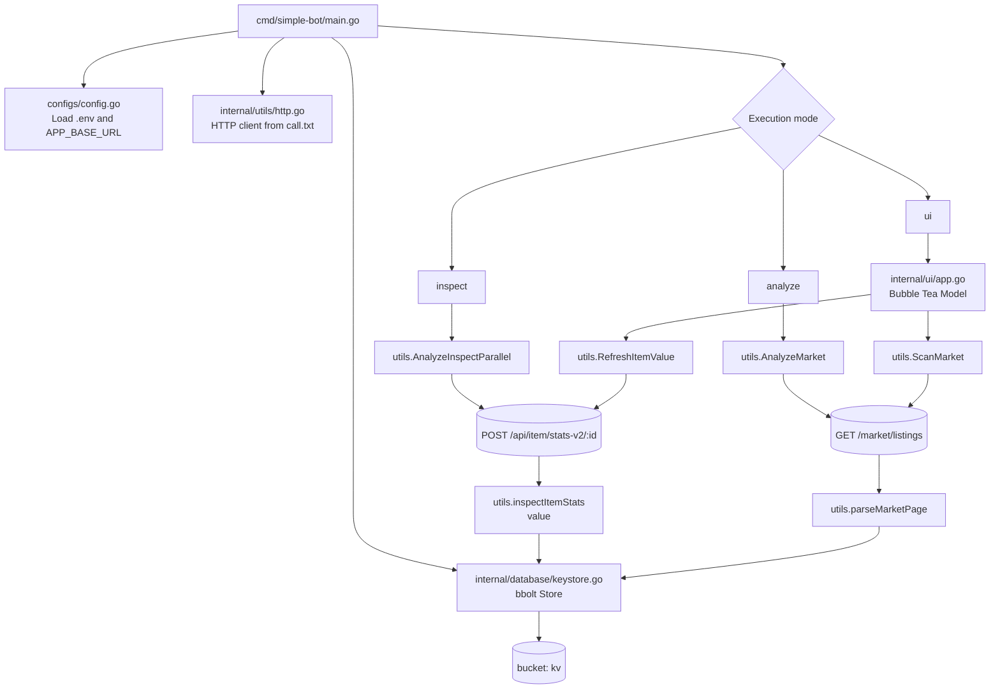
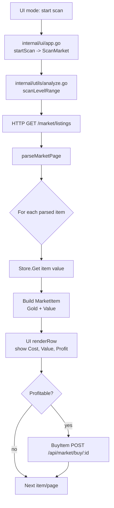

# Simple Bot 🤖

Simple Bot is a modern Go application for analyzing and automating item management in a live market in massive multiplayer online game (MMO).

## Features ✨
- Analyze and compare market items and their values
- Automatic buying and selling of items
- Store and retrieve results in a fast local database
- Bubble Tea terminal UI with market scan and DB operations
- Capture and persist item `value` data

## Requirements 📦
- Go 1.18+
- [bbolt](https://github.com/etcd-io/bbolt) for local storage

## Getting Started 🚀
1. Clone the repository
2. Copy `.env.template` to `.env` and set your environment variables
3. Build and run the application:
   ```sh
   go run ./cmd/simple-bot/main.go
   ```

## Run Modes
- `inspect <start_id> <end_id>`: bulk inspect IDs and persist values
- `analyze`: market analysis in terminal logs
- `ui`: interactive TUI (scan + local DB management)

## Local DB UX
- `update range` progress shows completion percentage (`%`) and failures while processing IDs.

## Internal Modules (Detailed)
- `cmd/simple-bot/main.go`
   - Entry point
   - Loads config, creates HTTP client, opens bbolt store, routes mode
- `configs/config.go`
   - Loads environment variables (mainly `APP_BASE_URL`)
- `internal/utils`
   - HTTP calls, parsing, inspect flow, market scan, buy operations
- `internal/ui`
   - Bubble Tea app state, scan view, DB view, range updates
- `internal/database/keystore.go`
   - bbolt storage abstraction for item values (`kv` bucket)
- `internal/models`
   - DTOs and domain models for market items and inspect payloads

## Architecture Diagram


## Internal Functional Flow (Modules)
